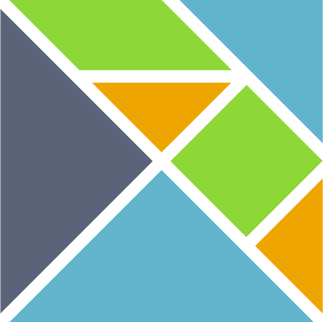

---

layout: ribbon

style: |
    .slide:after {
        display: none;
    }
    .slide.cover {
        background-color: white;
    }
    #Cover, #js {
        position: relative;
    }

    #Cover p img {
        width: 20%;
        position: absolute;
        right: 20%;
        left: initial;
        top: 40%;
    }
    #elm-counter pre code {
        font-size: 0.9em;
        line-height: initial;
    }
    #elm-json pre code {
        font-size: 0.8em;
        line-height: initial;
    }

---

# Journey on elm street {#Cover}

*Julien Tanguy*


<!-- official logo of elm-lang.org -->

## **Functional reactive programming**

## 
{:.cover .h}

## Counter example

```javascript
var up   = $('#up').asEventStream('click');
var down = $('#down').asEventStream('click');

var counter =
    // map up to 1, down to -1
    up.map(1).merge(down.map(-1))
    // accumulate sum
    .scan(0, function(x,y) { return x + y });

// assign observable value to jQuery property text
counter.assign($('#counter'), 'text');
```

## 
{:.cover .h}

## Counter example

```javascript
var up   = Rx.Observable.fromEvent($('#up'),'click');
var down = Rx.Observable.fromEvent($('#down'),'click');

var counter =
    // map up to 1, down to -1
    up.map(1).merge(down.map(-1))
    // accumulate sum
    .scan(0, function(x,y) { return x + y })
    .subscribe(function(total){$('#counter').text(total);});
```

## 
{:.cover .h}


## Elm

- Functional, reactive programming language for designing interfaces
- ...Haskell-like syntax
- ...**Static types**
- ...Compiled to JS
- ... ... with good perfs
- ...No runtime exception


## Counter example {#elm-counter}

```elm
type alias Model = Int
type Action = Increment | Decrement

update : Action -> Model -> Model
update action model =
  case action of
    Increment -> model + 1
    Decrement -> model - 1

view : Signal.Address Action -> Model -> Html
view address model =
  div []
    [ button [ onClick address Decrement ] [ text "-" ]
    , div [] [ text (toString model) ]
    , button [ onClick address Increment ] [ text "+" ]
    ]
```


## The elm architecture

- Model
- Update
- View

## Model

```elm
type alias Model = Int
```

## Update

```elm
type Action = Increment | Decrement

update : Action -> Model -> Model
update action model =
  case action of
    Increment -> model + 1
    Decrement -> model - 1
```

## View

```elm
import Html exposing(..)
import Html.Events exposing (onClick)

view : Signal.Address Action -> Model -> Html
view address model =
  div []
    [ button [ onClick address Decrement ] [ text "-" ]
    , div [] [ text (toString model) ]
    , button [ onClick address Increment ] [ text "+" ]
    ]
```

## Binding everything together

```elm
import StartApp.Simple exposing (start)

main =
  start { model = 0, update = update, view = view }
```

## **Tooling**

## elm-make

```bash
elm-make Main.elm                     # compile to HTML in index.html
elm-make Main.elm --output main.html  # compile to HTML in main.html
elm-make Main.elm --output elm.js     # compile to JS in elm.js
```

## elm-package.json {#elm-json}

```json
{
    "version": "1.0.0",
    "summary": "helpful summary of your project, less than 80 characters",
    "repository": "https://github.com/user/project.git",
    "license": "BSD3",
    "source-directories": [
        "."
    ],
    "exposed-modules": [],
    "dependencies": {
        "elm-lang/core": "3.0.0 <= v < 4.0.0",
        "evancz/elm-html": "4.0.1 <= v < 5.0.0",
        "evancz/start-app": "2.0.0 <= v < 3.0.0"
    },
    "elm-version": "0.16.0 <= v < 0.17.0"
}
```

## elm-package

```bash
elm-package install evancz/elm-html

elm-package publish
```


## elm-package bump

> Bump version numbers based on API changes

- Diff APIs between last tagged version and current
- Programmatically enforce SemVer

## **Types FTW**

## **elm-lang.org/try**

## References

- http://elm-lang.org
- https://github.com/evancz/elm-architecture-tutorial
- https://jtanguy.github.io/elm-intro
