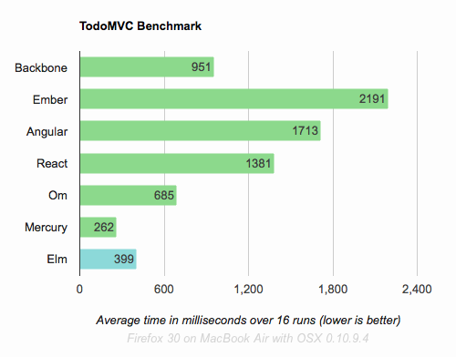

# Journey on elm street {#Cover}

*Julien Tanguy*


<!-- official logo of elm-lang.org -->

## **Functional reactive programming**

## 
{:.cover .h}

## Example

```javascript
var up   = $('#up').asEventStream('click');
var down = $('#down').asEventStream('click');

var counter =
    // map up to 1, down to -1
    up.map(1).merge(down.map(-1))
    // accumulate sum
    .scan(0, ((x,y) => x + y));

// assign observable value to jQuery property text
counter.assign($('#counter'), 'text');
```

## 
{:.cover .h}

## Example

```javascript
var up   = Rx.Observable.fromEvent($('#up'),'click');
var down = Rx.Observable.fromEvent($('#down'),'click');

var counter =
    // map up to 1, down to -1
    up.map(1).merge(down.map(-1))
    // accumulate sum
    .scan(0, ((x,y) => x + y))
    // subscribe
    .subscribe((total) => $('#counter').text(total));
```

## 
{:.cover .h}


## Elm

- Functional, reactive programming language for designing interfaces
- ...Haskell-like syntax
- ...**Static types**
- ...Compiled to JS
- ... ... with good perfs
- ... Great tooling
- ...No runtime exception

## 
{:.cover .h}

## Example {#elm-counter}

```elm
type alias Model = Int
type Action = Increment | Decrement

update : Action -> Model -> Model
update action model =
  case action of
    Increment -> model + 1
    Decrement -> model - 1

view : Signal.Address Action -> Model -> Html
view address model =
  div []
    [ button [ onClick address Decrement ] [ text "-" ]
    , div [] [ text (toString model) ]
    , button [ onClick address Increment ] [ text "+" ]
    ]
```

## **Haskell-like syntax**

## Literals

| JavaScript                 | Elm                    |
|----------------------------|------------------------|
| 3.1415                     | 3.1415                 |
| "Hello world!"             | "Hello world!"         |
| \`multiline string\` (ES6) | """multiline string""" |
| 'Hello world!'             | &empty;                |
| &empty;                    | 'a'                    |
| true                       | True                   |
| [1,2,3]                    | [1,2,3]                |

## Objects / Records

| JavaScript     | Elm                 |
|----------------+---------------------|
| { x: 3, y: 4 } | { x = 3, y = 4 }    |
| point.x        | point.x             |
| point.x = 42   | { point \| x = 42 } |


## Types

```elm
fortyTwo : Int
fortyTwo =
  42

names : List String
names =
  [ "Alice", "Bob", "Chuck" ]

book : { title: String, author: String, pages: Int }
book =
  { title = "Demian", author = "Hesse", pages = 176 }
```


## Types !

```elm
type Scale = Normal | Logarithmic

type Widget
    = ScatterPlot (List (Int, Int))
    | LogData (List String)
    | TimePlot Scale (List (Time, Int))

type Maybe a = Just a | Nothing
```

## TYPES !!

```elm
import String

longestName : List String -> Int
longestName names =
  List.maximum (List.map String.length names)


isLong : { record | pages : Int } -> Bool
isLong book =
  book.pages > 400
```

## Types !!

```elm
type alias Model = Int
type Action = Increment | Decrement

update : Action -> Model -> Model
view : Signal.Address Action -> Model -> Html
```

## **TYPES**

## Pattern matching ;)

```elm
-- String.toInt : String -> Result String Int

toMonth : String -> Maybe Int
toMonth rawString =
    case String.toInt rawString of
      Err message ->
          Nothing
      Ok n ->
          if n > 0 && n <= 12 then Just n else Nothing
```


## 
{:.cover .h}

## 
{:.cover .h}

## The elm architecture

- Model
- Update
- View


## Model

```elm
type alias Model = Int
```

## Update

```elm
type Action = Increment | Decrement

update : Action -> Model -> Model
update action model =
  case action of
    Increment -> model + 1
    Decrement -> model - 1
```

## View

```elm
import Html exposing(..)
import Html.Events exposing (onClick)

view : Signal.Address Action -> Model -> Html
view address model =
  div []
    [ button [ onClick address Decrement ] [ text "-" ]
    , div [] [ text (toString model) ]
    , button [ onClick address Increment ] [ text "+" ]
    ]
```

## Binding everything together

```elm
module Counter where

import StartApp.Simple exposing (start)

main =
  start { model = 0, update = update, view = view }
```


## Embedding

Include generated elm.js, it exposes a `Elm` object.

```html
var div = document.getElementById('counter');
Elm.embed(Elm.Counter, div);
<!-- or -->
Elm.fullscreen(Elm.Counter);
```

## **JS interop**

## **Ports**

## From JavaScript to Elm

```elm
-- Declaration
port addUser : Signal (String, UserRecord)
```

```JavaScript
// Usage
myapp.ports.addUser.send([
  "Tom",
  { age: 32, job: "lumberjack" }
]);

```

## From Elm to JavaScript

```elm
-- Declaration
port requestUser : Signal String
port requestUser =
    signalOfUsersWeWantMoreInfoOn
```

```JavaScript
// Usage
myapp.ports.requestUser.subscribe(databaseLookup);

function databaseLookup(user) {
    var userInfo = database.lookup(user);
    myapp.ports.addUser.send(user, userInfo);
}

// Unsubscribe
myapp.ports.requestUser.unsubscribe(databaseLookup);
```

## Customs and border protection

- Booleans and Strings – both exist in Elm and JS!
- Numbers – Elm ints and floats correspond to JS numbers
- Lists, Arrays – correspond to JS arrays
- Tuples – correspond to fixed-length, mixed-type JS arrays
- Records – correspond to JavaScript objects
- Signals – correspond to event streams in JS
- Maybes – `Nothing` and `Just 42` correspond to `null` and `42`
- Json – Json.Encode.Value corresponds to arbitrary JSON


## **Tooling**

## elm-make

### Compiling
```no-highlight
elm-make Main.elm
elm-make Main.elm --output elm.js

elm-make Main.elm --output main.html
```

## elm-package.json {#elm-json}

```json
{
    "version": "1.0.0",
    "summary": "helpful summary of your project",
    "repository": "https://github.com/user/project.git",
    "license": "BSD3",
    "source-directories": [
        "."
    ],
    "exposed-modules": [],
    "dependencies": {
        "elm-lang/core": "3.0.0 <= v < 4.0.0",
        "evancz/elm-html": "4.0.1 <= v < 5.0.0",
        "evancz/start-app": "2.0.0 <= v < 3.0.0"
    },
    "elm-version": "0.16.0 <= v < 0.17.0"
}
```

## elm-package

```no-highlight
elm-package install evancz/elm-html

elm-package install

elm-package publish
```


## elm-package bump

> Bump version numbers based on API changes

- Diff APIs between last tagged version and current
- Programmatically enforce SemVer

## **Types FTW**


## **elm-lang.org/try**

## References

- http://elm-lang.org
- https://github.com/evancz/elm-architecture-tutorial
- https://jtanguy.github.io/elm-intro
